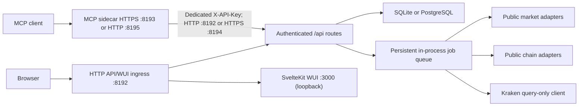

# Architecture

## Runtime

The application container starts two child processes:

- the HTTP API/WUI ingress on port 8192;
- the optional HTTPS API ingress on port 8194;
- the SvelteKit WUI on loopback port 3000.

Ingress owns authentication, CSRF, security headers, API routes, health checks, and WUI proxying. The launcher treats the API and WUI children as required and coordinates graceful shutdown.

MCP runs as a separate `cryptotracker-mcp` sidecar process/container. It owns client Bearer authentication, tool authorization, dry-run planning, rate limits, and bounded redacted MCP history. It calls the API over a configured HTTP or HTTPS base URL using a dedicated upstream API key. The API and sidecar mount the same certificate volume.

## Data boundaries

The database is the canonical cache and job store. There is no Redis dependency.

- Decimal quantities and values are stored as strings and calculated with `decimal.js`.
- UTC epoch milliseconds are used for bucket keys; API and export metadata include UTC timestamps.
- Raw/native provider points and derived points have distinct uniqueness keys.
- Finalized source-resolution data is retained indefinitely. Coarser display rows are derived without deleting or fabricating fine data.
- SQLite runs in WAL mode with `synchronous=FULL` by default.
- PostgreSQL uses a bounded pool and optional TLS.

SQLite and PostgreSQL migrations are paired under `api/migrations/sqlite` and `api/migrations/postgres`. Startup applies migrations before readiness.

## Synchronization

The database-backed job queue persists payloads, priorities, progress, cursors, attempts, structured errors, and retry times. Resource keys serialize work for one upstream resource; idempotency keys and coalescing prevent duplicate refreshes.

Each provider has an independent spacing/concurrency/token-bucket limiter with bounded retries, `Retry-After`, jittered backoff, cooldown, coalescing, and health state.

Market reads return cached rows immediately. Scheduled and manual jobs overlap recent buckets to repair revisions. Coarser OHLC is produced only from cached finer data. Missing exchange quote pairs may be converted with a same-bucket CoinGecko ratio and are marked derived with both provenance chains.

Address adapters persist provider cursors and completeness boundaries:

- Bitcoin uses Esplora address pages and the current tip for configurable finality;
- Dogecoin uses BlockCypher full-address pages with block-height cursors;
- Ethereum uses Etherscan page/start-block cursors for native and selected ERC-20 transfers;
- Polkadot uses Subscan transfer pages when a Subscan API key is configured;
- Solana uses Helius signature pagination for native and selected SPL activity.

Kraken has an immutable query-only endpoint allowlist. Trade, ledger, and Earn imports persist page cursors, resume interrupted initial imports, and overlap the most recent completed range for incremental sync.

## Authentication and security

Local and trusted-header authentication can coexist. Trusted headers are accepted only when the direct peer matches configured CIDRs and the identity matches an allowed user or any allowed group. Optional signed identity verification adds issuer, audience, expiry, and HMAC validation.

Mutations require an authenticated session, same-origin request, and CSRF token. Secrets are startup-only, excluded from public runtime payloads and exports, and redacted from logs. Application exports omit password hashes, sessions, CSRF material, credentials, and trusted-proxy signing secrets.

All upstream adapters enforce explicit read-only path allowlists. URL construction keeps configured API path prefixes and does not accept user-controlled upstream origins.

## WUI

The desktop-first SvelteKit UI follows the adjacent WUI styleguide: monospace tool aesthetic, semantic status colours, raised controls, restrained panels, keyboard access, responsive tables, and dark/light themes.

One ECharts component implements range/custom-range, UTC conversion from the configured timezone, granularity, linear/log scale, independent bounds, normalization, candles and wicks, synchronized volume, event filters, keyboard inspection, accessible provenance tables, and graph exports.
